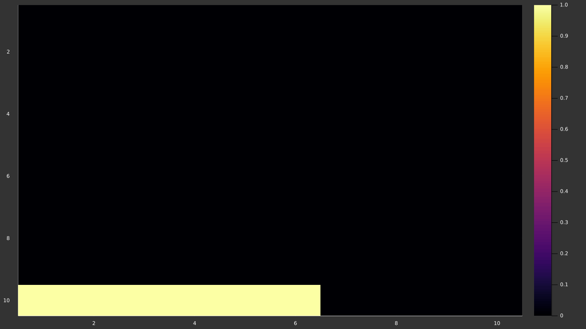
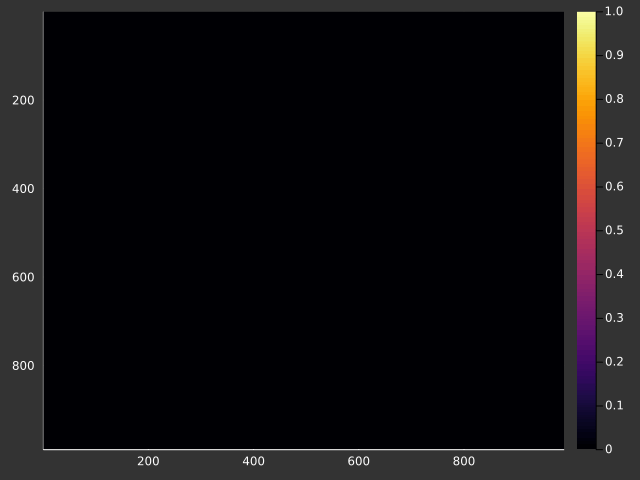
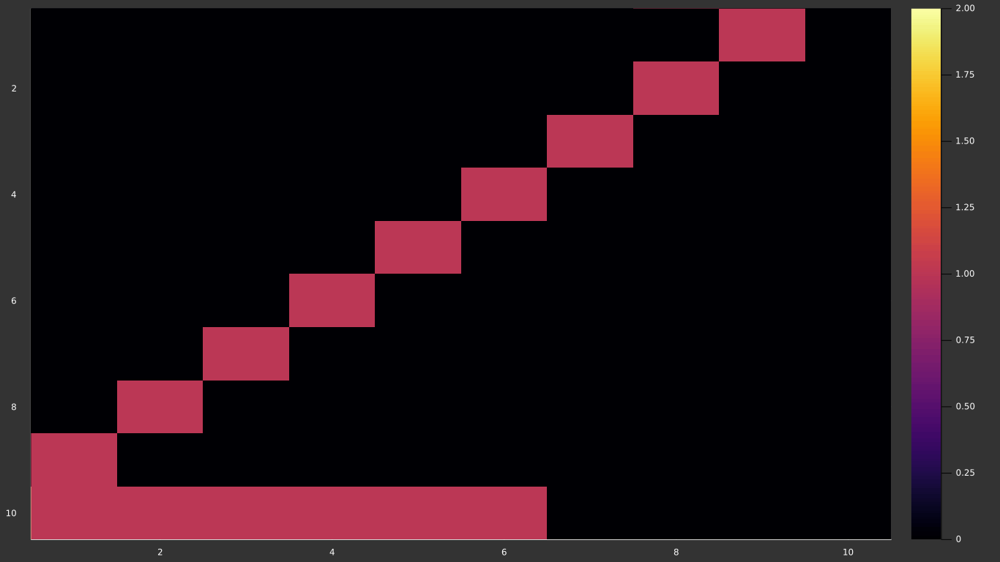
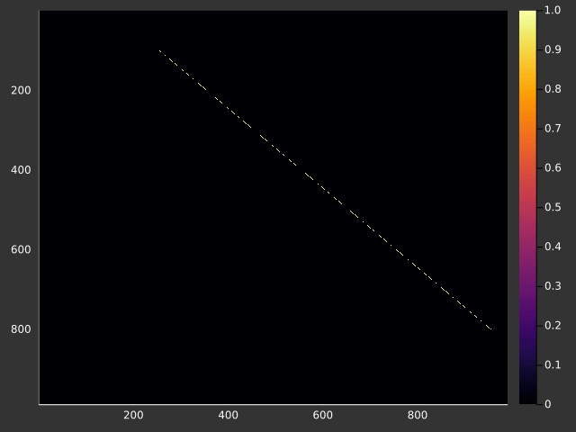

# Day05

Had the idea to plot each state of the grid as a heatmap and make and a gif out
of it. Plots.jl take some time to save at reasonable resolution from my laptop,
so the pngs were 640 by 480.

## Part 1

## Part 2

