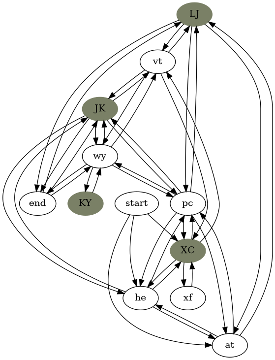

# Day12

This day screams the usage of graphs, so a visualization should be pretty
straightforward. The julia program generates a `graph.dot` file. Then, running
the command:

``` console
dot -Tpng graph.dot -o ./figs/graph.png
```

And there we go:


